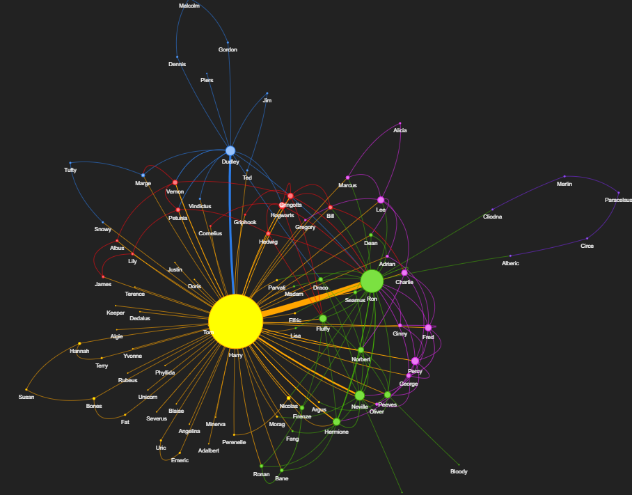

# Harry Potter network

This is a network of characters from the Harry Potter books. This has been done for only the first novel, Harry Potter and the Philosopher's Stone. But the code can be easily modified to work for other parts as well.

You can find network inside the **'Harry Potter Network.ipynb'** file.

